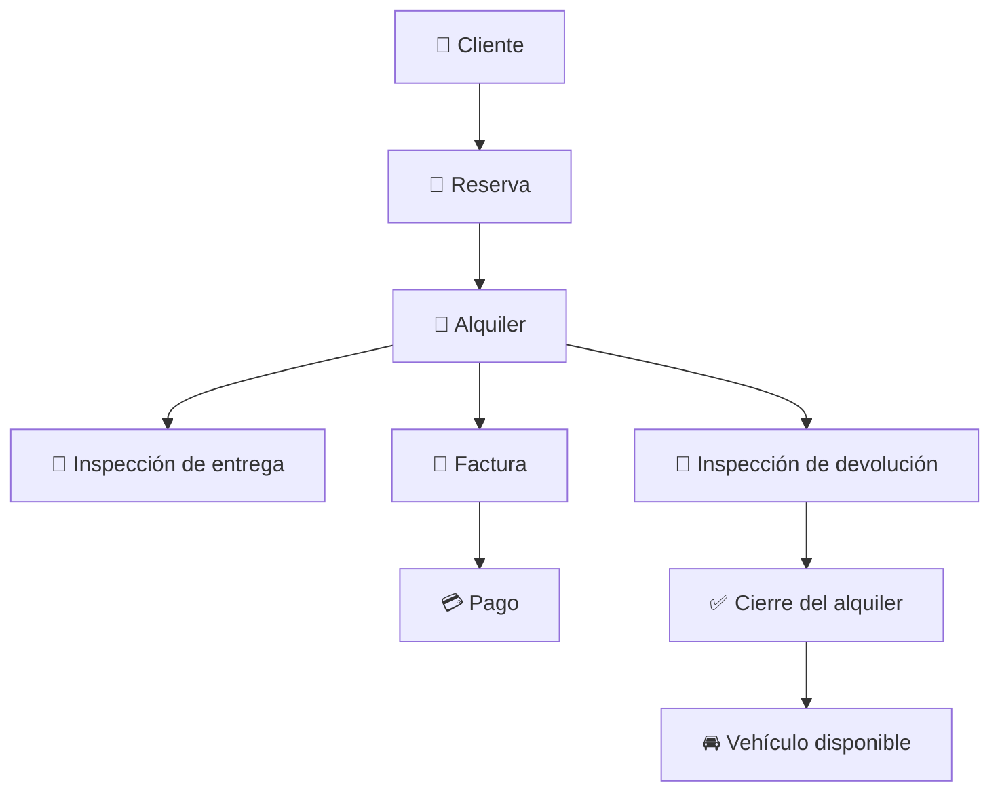

<p align="center">
  
</p>

<p align="center">
   
</p>


<p align="center">

  
  
  
</p>

<p align="center">
  
  
  
  
</p>

# 🚘 RentaDrive

**RentaDrive** es una plataforma web profesional para la gestión integral de empresas de alquiler de vehículos. Centraliza clientes, flota, reservas, alquileres, contratos, inspecciones, mantenimiento, facturación, pagos, reportes, usuarios, configuración y auditoría dentro de un flujo operativo completo.

El proyecto nació como trabajo final de la asignatura **Análisis y Diseño de Sistemas** del Instituto Tecnológico de Las Américas (ITLA) y fue reconstruido como una aplicación funcional con Laravel, Microsoft SQL Server y una arquitectura monolítica modular orientada a mantenibilidad, seguridad y escalabilidad.

## ✅ Estado actual

La versión **1.0.0** se considera finalizada y lista para uso académico, portafolio profesional y evolución comercial.

- 🧪 **35 pruebas automatizadas** aprobadas.
- 🎯 **103 assertions** ejecutadas correctamente.
- 🎨 Laravel Pint validado.
- ⚡ Build de Vite aprobado.
- 🗄️ Compatibilidad con SQL Server y SQLite en memoria para testing.
- 📊 Dashboard operativo con métricas, gráficos y calendario.
- 📱 Aplicación instalable como PWA.
- 📄 Facturas, contratos y reportes operativos exportables en PDF.
- 📤 Exportación de reportes en CSV.

# 🧩 Funcionalidades

## 🚗 Operaciones

- 👤 Gestión completa de clientes, contacto, documentos y licencias.
- 🪪 Validación local de cédulas dominicanas por dígito verificador.
- 🧹 Normalización automática de cédulas antes de guardar.
- 🔢 Validación de longitud para cédula, RNC y pasaporte.
- 🚘 Administración de marcas, modelos, categorías, tarifas, depósitos y vehículos.
- 🚦 Estados de flota: disponible, reservado, alquilado, mantenimiento e inactivo.
- 🛠️ Historial y programación de mantenimientos.
- 📅 Reservas con validación de disponibilidad y solapamiento.
- 🔄 Conversión de reservas en alquileres.
- 🔑 Apertura y cierre de alquileres.
- ⛽ Gestión de kilometraje, combustible, depósito, cargos y fechas.
- 📄 Contrato imprimible por alquiler.
- 📸 Inspecciones de entrega y devolución.
- ✅ Actualización automática del estado del vehículo.

## 💰 Finanzas

- 🧾 Facturación automática al abrir un alquiler.
- 🔄 Recálculo de factura al devolver el vehículo.
- 🇩🇴 ITBIS fijo del **18 %** protegido desde backend.
- 🏷️ Gestión de descuentos, vencimientos y notas.
- 💳 Pagos parciales y totales.
- 🧾 Recibos con método de pago y referencia.
- ↩️ Anulación de pagos y recálculo del balance.
- 📄 Facturas y contratos en PDF.
- 📊 Reportes operativos en PDF y CSV.
- 📗 Soporte para Laravel Excel.

## 📊 Dashboard y experiencia de usuario

- 📈 Indicadores operativos en tiempo real.
- 💹 Gráfico de ingresos de los últimos seis meses.
- 🚙 Gráfico de distribución del estado de la flota.
- 🗓️ Calendario mensual de reservas.
- ⚡ Accesos rápidos para nuevas reservas y alquileres.
- 🔔 Notificaciones tipo toast.
- 🌗 Modo claro y oscuro.
- 📱 Diseño responsive.
- 🚫 Páginas personalizadas para errores 404 y 500.
- 📲 Manifest y service worker para instalación como PWA.
- 🎯 Navegación enriquecida con iconos de Font Awesome.

## 🔐 Administración y seguridad

- 👥 Gestión de usuarios activos e inactivos.
- 🛡️ Roles: Administrador, Gerente, Agente de alquiler e Inspector.
- 🔑 Permisos por módulo y operación.
- 🚧 Policies y middleware de autorización.
- 🚫 Registro público deshabilitado.
- 🧿 Protección CSRF.
- ✅ Validaciones mediante Form Requests.
- 🧾 Auditoría automática de creaciones, modificaciones y eliminaciones.
- 🗑️ Eliminación segura de cuentas con limpieza de referencias relacionadas.

# 🔄 Flujo principal



# 🧰 Stack tecnológico

## ⚙️ Backend

<p>
  
  
  
</p>

- 🐘 **PHP 8.4.1 o superior**.
- 🔺 **Laravel 13.8**.
- 📦 **Composer** para dependencias y scripts.
- 🗃️ **Eloquent ORM** para persistencia y relaciones.
- 🧱 Migraciones, seeders, factories y servicios de dominio.
- 🧩 Arquitectura monolítica modular.

## 🎨 Frontend

<p>
  
  
  
  
  
</p>

- 🧩 **Blade** y HTML5.
- 🎨 **Tailwind CSS 3.4**.
- 🏔️ **Alpine.js 3.15**.
- 🟨 **JavaScript ES Modules**.
- 📊 **Chart.js 4.5**.
- ⚡ **Laravel Vite Plugin 3.1**.
- ⭐ **Font Awesome 6.7**.

## 🗄️ Base de datos

<p>
  
  
</p>

- 🗄️ **Microsoft SQL Server 2017 o superior** como motor principal.
- 🔌 **ODBC Driver 17 o 18**.
- 🧩 Extensiones PHP `sqlsrv` y `pdo_sqlsrv`.
- 🧪 **SQLite en memoria** para pruebas automatizadas.

## 🛡️ Seguridad y autorización

- 🔐 Laravel Breeze.
- 👮 Spatie Laravel Permission 8.3.
- 🚧 Policies, middleware y permisos por módulo.
- 🧿 CSRF, sesiones seguras y validación de entradas.
- 🧾 Auditoría de operaciones sensibles.

## 📄 Documentos y exportaciones

- 📕 DomPDF 3.1 para contratos, facturas y reportes.
- 📗 Laravel Excel 3.1.
- 📤 Exportación CSV.

## 🧪 Calidad, build y CI

<p>
  
  
  
  
  
</p>

- 🟢 Node.js 22 o superior.
- 📦 npm 10 o superior.
- ⚡ Vite 8.
- 🧪 PHPUnit 12.5.
- 🎨 Laravel Pint 1.27.
- 🎭 Mockery y Faker.
- 🤖 GitHub Actions para integración continua.

# 📋 Requisitos

- 🐘 PHP 8.4.1 o superior.
- 📦 Composer 2.7 o superior.
- 🗄️ Microsoft SQL Server 2017 o superior.
- 🔌 Microsoft ODBC Driver 17 o 18.
- 🧩 Extensiones `sqlsrv` y `pdo_sqlsrv`.
- 🟢 Node.js 22 o superior.
- 📦 npm 10 o superior.
- 🌿 Git.

Extensiones PHP recomendadas:

```text
ctype
curl
dom
fileinfo
filter
hash
mbstring
openssl
pdo
pdo_sqlsrv
session
sqlsrv
tokenizer
xml
zip
```

# 📥 Instalación

## 1️⃣ Clonar el repositorio

```bash
git clone https://github.com/Jairo0811/RentaDrive.git
cd RentaDrive
```

## 2️⃣ Instalar dependencias

```bash
composer install
npm install
```

## 3️⃣ Crear el archivo de entorno

Linux o macOS:

```bash
cp .env.example .env
```

Windows PowerShell:

```powershell
Copy-Item .env.example .env
```

## 4️⃣ Generar la clave de Laravel

```bash
php artisan key:generate
```

## 5️⃣ Crear la base de datos

Ejecuta en SQL Server Management Studio o Azure Data Studio:

```sql
IF DB_ID(N'RentaDriveDb') IS NULL
BEGIN
    CREATE DATABASE [RentaDriveDb];
END;
GO
```

## 6️⃣ Crear el login de aplicación

```sql
USE [master];
GO

IF NOT EXISTS (
    SELECT 1
    FROM sys.server_principals
    WHERE name = N'rentadrive_app'
)
BEGIN
    CREATE LOGIN [rentadrive_app]
    WITH PASSWORD = 'RentaDrive_Local_2026!',
         CHECK_POLICY = ON,
         CHECK_EXPIRATION = OFF;
END
ELSE
BEGIN
    ALTER LOGIN [rentadrive_app]
    WITH PASSWORD = 'RentaDrive_Local_2026!';

    ALTER LOGIN [rentadrive_app] ENABLE;
END;
GO

USE [RentaDriveDb];
GO

IF NOT EXISTS (
    SELECT 1
    FROM sys.database_principals
    WHERE name = N'rentadrive_app'
)
BEGIN
    CREATE USER [rentadrive_app]
    FOR LOGIN [rentadrive_app];
END;
GO

ALTER ROLE [db_datareader] ADD MEMBER [rentadrive_app];
ALTER ROLE [db_datawriter] ADD MEMBER [rentadrive_app];
ALTER ROLE [db_ddladmin] ADD MEMBER [rentadrive_app];
GO
```

> ⚠️ La contraseña anterior es únicamente un ejemplo para desarrollo local. Debe sustituirse en cualquier entorno compartido o productivo.

## 7️⃣ Configurar `.env`

```dotenv
APP_NAME=RentaDrive
APP_ENV=local
APP_DEBUG=true
APP_URL=http://127.0.0.1:8000

APP_TIMEZONE=America/Santo_Domingo
APP_LOCALE=es
APP_FALLBACK_LOCALE=es
APP_FAKER_LOCALE=es_DO

DB_CONNECTION=sqlsrv
DB_HOST=127.0.0.1
DB_PORT=1433
DB_DATABASE=RentaDriveDb
DB_USERNAME=rentadrive_app
DB_PASSWORD=RentaDrive_Local_2026!
DB_ENCRYPT=no
DB_TRUST_SERVER_CERTIFICATE=true

SESSION_DRIVER=file
CACHE_STORE=file
QUEUE_CONNECTION=sync

RENTADRIVE_ADMIN_EMAIL=admin@rentadrive.com.do
RENTADRIVE_ADMIN_PASSWORD=RentaDrive123..
```

Para producción:

```dotenv
APP_ENV=production
APP_DEBUG=false
DB_ENCRYPT=yes
DB_TRUST_SERVER_CERTIFICATE=false
```

## 8️⃣ Crear las tablas y datos iniciales

Instalación nueva:

```bash
php artisan optimize:clear
php artisan migrate:fresh --seed
```

Base existente:

```bash
php artisan optimize:clear
php artisan migrate
php artisan db:seed
```

## 9️⃣ Crear el enlace de almacenamiento

```bash
php artisan storage:link
```

## 🔟 Compilar frontend

```bash
npm run build
```

## 1️⃣1️⃣ Ejecutar validaciones

```bash
vendor/bin/pint --test
php artisan test
npm run build
```

Resultado validado:

```text
35 pruebas aprobadas
103 assertions
```

## 1️⃣2️⃣ Iniciar la aplicación

```bash
php artisan serve
```

Abre:

```text
http://127.0.0.1:8000
```

# 🚀 Desarrollo local

Ejecutar todos los procesos:

```bash
composer run dev
```

O por separado:

```bash
php artisan serve
php artisan queue:listen --tries=1
npm run dev
```

# 🔑 Credenciales iniciales

Estas credenciales se crean mediante el seeder únicamente para desarrollo local:

```text
Correo: admin@rentadrive.com.do
Contraseña: RentaDrive123..
```

> 🔒 Cambia estas credenciales antes de publicar la aplicación o usarla en un entorno compartido.

## 👥 Roles incluidos

- 👑 Administrador.
- 📊 Gerente.
- 🚗 Agente de alquiler.
- 🔍 Inspector.

# 🧪 Testing

Ejecutar toda la suite:

```bash
php artisan test
```

Solo pruebas unitarias:

```bash
php artisan test --testsuite=Unit
```

Solo pruebas funcionales:

```bash
php artisan test --testsuite=Feature
```

Validar formato sin modificar archivos:

```bash
vendor/bin/pint --test
```

# 🗂️ Estructura principal

```text
app/
├── Domain/
├── Http/
├── Models/
├── Policies/
├── Rules/
└── Services/

database/
├── factories/
├── migrations/
└── seeders/

resources/
├── css/
├── js/
└── views/
    ├── auth/
    ├── components/
    ├── customers/
    ├── documents/
    ├── invoices/
    ├── layouts/
    ├── rentals/
    └── reports/

tests/
├── Feature/
└── Unit/
```

# 🛠️ Solución de problemas

## SQL Server no conecta

Verifica:

```bash
php -m | findstr /I "sqlsrv pdo_sqlsrv"
```

También confirma que SQL Server esté escuchando en el puerto `1433` y que el usuario configurado tenga acceso a `RentaDriveDb`.

## Cambios visuales no aparecen

```bash
php artisan optimize:clear
npm run build
```

## El PDF no muestra imágenes

Confirma que los logos existan dentro de:

```text
public/images/
```

Las plantillas de DomPDF utilizan rutas locales mediante `public_path()`.

# 🗺️ Evolución futura

La versión 1.0.0 está cerrada. Posibles líneas de evolución para una versión 2.0:

- 🏢 Multiempresa y multisucursal.
- ✍️ Firma digital de contratos.
- 📧 Envío de documentos por correo.
- 💬 Integración con WhatsApp.
- 🗓️ Calendario visual avanzado de disponibilidad.
- 🔌 API REST documentada con OpenAPI/Swagger.
- 🪪 Integración oficial con servicios de identidad cuando exista acceso autorizado.

# 🎓 Información académica

- **Institución:** Instituto Tecnológico de Las Américas (ITLA).
- **Asignatura:** Análisis y Diseño de Sistemas.
- **Período:** 2017-C1.
- **Repositorio modernizado:** 2026.

# 👨‍💻 Autor

**Jairo Matías**  
GitHub: [@Jairo0811](https://github.com/Jairo0811)

# 📄 Licencia

Este proyecto se distribuye bajo la licencia **MIT**.
