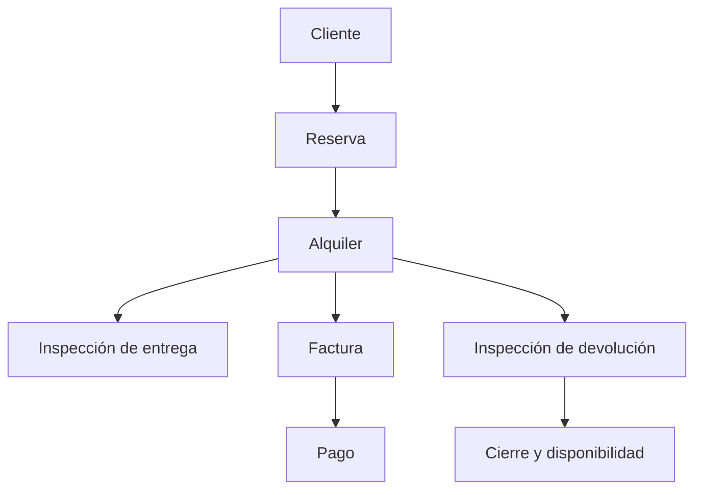

# 🚘 RentaDrive

> **Gestiona tu flota. Impulsa tu negocio.**

RentaDrive es un sistema web para administrar empresas de alquiler de vehículos. Integra clientes, flota, reservas, alquileres, contratos, inspecciones, mantenimiento, facturación, pagos, reportes y auditoría en un flujo operativo completo.

El proyecto nació como trabajo final de Análisis y Diseño de Sistemas en el ITLA y fue reconstruido como una aplicación profesional con Laravel, SQL Server y una arquitectura monolítica modular.


## Funcionalidades

### Operaciones

- Expedientes de clientes con documentos, contacto y licencia.
- Marcas, modelos, categorías, tarifas, depósitos y vehículos.
- Estados de flota: disponible, reservado, alquilado, mantenimiento e inactivo.
- Historial y programación de mantenimiento.
- Reservas con validación de solapamiento por vehículo.
- Conversión de una reserva en alquiler.
- Alquileres con kilometraje, combustible, tarifa, depósito y cargos.
- Cálculo automático de días, impuestos y total.
- Contrato imprimible por alquiler.
- Inspecciones de entrega y devolución con fotografías.
- Cierre del alquiler y actualización automática de la unidad.

### Finanzas

- Factura automática al abrir un alquiler.
- Recalculo de factura al devolver el vehículo.
- Descuentos, fecha de vencimiento y notas.
- Pagos parciales o totales.
- Recibos con método y referencia.
- Anulación de pagos y recálculo del balance.
- Facturas descargables en PDF.
- Exportación de operaciones a CSV.

### Administración

- Dashboard con indicadores reales.
- Roles: Administrador, Gerente, Agente de alquiler e Inspector.
- Permisos por módulo y operación.
- Gestión de usuarios activos e inactivos.
- Configuración del negocio, moneda, ITBIS y ubicación.
- Auditoría automática de creaciones, cambios y eliminaciones.
- Registro público deshabilitado.
- Modo claro/oscuro y diseño responsive.

## Flujo principal



## Tecnologías

<p>
  
  
  
  
  
  
  
</p>

| Área | Tecnología |
|---|---|
| Backend | PHP 8.3+, Laravel 13 |
| Interfaz | Blade, Tailwind CSS 3, Alpine.js |
| Datos | Microsoft SQL Server 2017+ |
| Seguridad | Laravel Breeze, Policies, Spatie Laravel Permission |
| Documentos | DomPDF |
| Exportaciones | CSV y Laravel Excel disponible |
| Build | Vite 8 |
| Pruebas | PHPUnit 12 |

## Requisitos

- PHP 8.3 o superior.
- Composer 2.7 o superior.
- Microsoft SQL Server 2017 o superior.
- Microsoft ODBC Driver 18 for SQL Server.
- Extensiones PHP `sqlsrv` y `pdo_sqlsrv`.
- Node.js 22 o superior.
- npm 10 o superior.

## Instalación

```bash
git clone https://github.com/Jairo0811/RentaDrive.git
cd RentaDrive
composer install
npm install
cp .env.example .env
php artisan key:generate
```

Crea `RentaDriveDb` en SQL Server y configura `.env`. Para autenticación de Windows local:

```dotenv
DB_CONNECTION=sqlsrv
DB_HOST=localhost
DB_PORT=null
DB_DATABASE=RentaDriveDb
DB_USERNAME=null
DB_PASSWORD=null
DB_ENCRYPT=yes
DB_TRUST_SERVER_CERTIFICATE=true
```

Luego ejecuta:

```bash
php artisan optimize:clear
php artisan migrate --seed
php artisan storage:link
npm run build
php artisan test
php artisan serve
```

Abre `http://127.0.0.1:8000`.

### Actualización desde la fase 1

Si ya tienes autenticación, roles y el administrador funcionando, no borres la base. Reemplaza los archivos y ejecuta:

```bash
php artisan optimize:clear
php artisan migrate
php artisan db:seed
php artisan storage:link
npm run build
php artisan test
```

La migración operativa agrega las tablas nuevas sin eliminar usuarios, permisos ni información existente.

## Credenciales locales

El seeder crea este usuario únicamente en `local` y `testing`:

```text
Correo: admin@rentadrive.test
Contraseña: password
```

Puedes cambiarlo antes de sembrar:

```dotenv
RENTADRIVE_ADMIN_EMAIL=admin@rentadrive.test
RENTADRIVE_ADMIN_PASSWORD=una-clave-local-segura
```

## Roles

| Rol | Alcance |
|---|---|
| Administrador | Acceso completo, configuración, usuarios y auditoría |
| Gerente | Consultas operativas, financieras y reportes |
| Agente de alquiler | Clientes, reservas, alquileres, contratos y devoluciones |
| Inspector | Flota, alquileres e inspecciones |

## Estructura

```text
app/
├── Domain/
│   ├── Operations/Services/
│   └── Security/
├── Http/
│   ├── Controllers/
│   └── Requests/
├── Models/
│   └── Concerns/Auditable.php
├── Policies/
└── Providers/
database/
├── migrations/
└── seeders/
resources/
├── css/
├── js/
└── views/
    ├── customers/
    ├── vehicles/
    ├── reservations/
    ├── rentals/
    ├── inspections/
    ├── invoices/
    ├── payments/
    ├── reports/
    └── administration/
```

## Pruebas y calidad

```bash
php artisan test
./vendor/bin/pint --test
npm run build
```

Las pruebas usan SQLite en memoria. La integración continua repite migraciones y pruebas contra SQL Server 2022.

Cobertura funcional incluida:

- autenticación y usuario inactivo;
- registro público deshabilitado;
- roles, permisos y Policy de usuarios;
- acceso a módulos por rol;
- disponibilidad y solapamiento de reservas;
- apertura de alquiler, cambio de estado y factura automática.

## Seguridad

- No se versionan secretos ni `.env`.
- El registro público está deshabilitado.
- Los permisos se validan en backend.
- La auditoría excluye contraseña y token de sesión.
- El usuario de demostración no se crea en producción.
- Los importes de pagos se validan contra el balance pendiente.
- Reservas y alquileres usan transacciones para evitar estados parciales.
- `APP_DEBUG` debe estar en `false` en producción.

## Información académica

| Información | Detalle |
|---|---|
| 👨‍🎓 Estudiante | Francis Jairo Matías Rosario |
| 🆔 Matrícula | 2015-2984 |
| 📖 Asignatura | Análisis y Diseño de Sistemas (SOF-007) |
| 👨‍🏫 Profesor | Huáscar Frías Vilorio |
| 🏫 Institución | Instituto Tecnológico de Las Américas (ITLA) |
| 📅 Período académico | 2017-C1 |
| 🎯 Tipo de proyecto | Proyecto final |

## Documentación

- [Fase 1 — Fundación técnica](docs/analysis/phase-1.md)
- [Versión 1.0 — Alcance, fases y criterios](docs/analysis/version-1.md)

## Licencia

Distribuido bajo la licencia [MIT](LICENSE).
