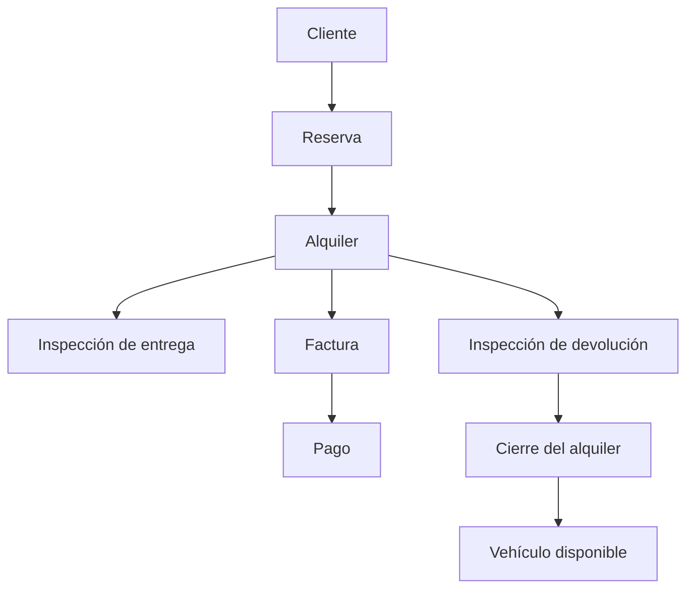

# 🚘 RentaDrive

<p align="center">
  
</p>


<p align="center">
  <strong>Gestiona tu flota. Impulsa tu negocio.</strong>
</p>

<p align="center">
  
</p>

<p align="center">
  
  
  
  
  
</p>

RentaDrive es un sistema web profesional para administrar empresas de alquiler de vehículos. Integra clientes, flota, reservas, alquileres, contratos, inspecciones, mantenimiento, facturación, pagos, reportes, usuarios, configuración y auditoría dentro de un flujo operativo completo.

El proyecto nació como trabajo final de **Análisis y Diseño de Sistemas** en el Instituto Tecnológico de Las Américas (ITLA) y fue reconstruido como una aplicación funcional con Laravel, Microsoft SQL Server y una arquitectura monolítica modular.

## 📌 Funcionalidades principales

### Operaciones

- Gestión completa de clientes, documentos, contacto y licencias.
- Administración de marcas, modelos, categorías, tarifas, depósitos y vehículos.
- Estados de flota: disponible, reservado, alquilado, mantenimiento e inactivo.
- Historial y programación de mantenimientos.
- Reservas con validación de disponibilidad y solapamiento por vehículo.
- Conversión de reservas en alquileres.
- Alquileres con fechas, kilometraje, combustible, tarifa, depósito y cargos.
- Cálculo automático de días, subtotal, impuestos y total.
- Contrato imprimible por alquiler.
- Inspecciones de entrega y devolución con fotografías.
- Cierre del alquiler y actualización automática del estado del vehículo.

### Finanzas

- Factura automática al abrir un alquiler.
- Recalculo de factura al devolver el vehículo.
- Gestión de descuentos, fecha de vencimiento y notas.
- Pagos parciales o totales.
- Recibos con método de pago y referencia.
- Anulación de pagos y recálculo del balance.
- Facturas descargables en PDF.
- Exportación de operaciones a CSV.

### Administración y seguridad

- Dashboard con indicadores operativos reales.
- Usuarios activos e inactivos.
- Roles: Administrador, Gerente, Agente de alquiler e Inspector.
- Permisos por módulo y operación.
- Configuración del negocio, moneda, ITBIS y ubicación.
- Auditoría automática de creaciones, modificaciones y eliminaciones.
- Registro público deshabilitado.
- Validaciones de autorización en backend.
- Modo claro y oscuro.
- Diseño responsive.

## 🔄 Flujo principal



# 🧰 Stack tecnológico

## Backend

<p>
  
  
  
</p>

- **PHP 8.3+** como lenguaje principal del servidor.
- **Laravel 13** como framework web y base del monolito modular.
- **Composer** para gestionar dependencias PHP y scripts del proyecto.
- **Eloquent ORM** para consultas, relaciones y persistencia.
- **Migraciones y seeders** para crear y poblar la base de datos.

## Frontend

<p>
  
  
  
  
  
</p>

- **Blade** para las vistas renderizadas por Laravel.
- **HTML5** para la estructura de las interfaces.
- **Tailwind CSS 3** para estilos, diseño responsive y modo oscuro.
- **Alpine.js 3** para interacciones ligeras.
- **JavaScript** para comportamiento del frontend.
- **Chart.js 4** para indicadores y gráficos del dashboard.
- **Laravel Vite Plugin** para integrar el build del frontend con Laravel.

## Base de datos y persistencia

<p>
  
</p>

- **Microsoft SQL Server 2017+** como motor de base de datos principal.
- **Microsoft ODBC Driver 17 o 18** para la conexión desde PHP.
- Extensiones PHP **`sqlsrv`** y **`pdo_sqlsrv`**.
- **SQLite en memoria** exclusivamente para pruebas automatizadas locales.

## Autenticación, autorización y seguridad

- **Laravel Breeze** para la base de autenticación.
- **Spatie Laravel Permission** para roles y permisos.
- **Policies y middleware** para autorización del lado del servidor.
- Protección **CSRF**.
- Regeneración de sesión al autenticar.
- Validación mediante **Form Requests**.
- Auditoría de operaciones sensibles.
- Registro público deshabilitado.

## Documentos y exportaciones

- **DomPDF** para contratos y facturas en PDF.
- **Laravel Excel** disponible para exportaciones estructuradas.
- **CSV** para exportación de operaciones.

## Build y herramientas de desarrollo

<p>
  
  
  
  
  
</p>

- **Node.js 22+** y **npm 10+** para dependencias del frontend.
- **Vite 8** para compilar CSS y JavaScript.
- **PostCSS** y **Autoprefixer** para procesamiento CSS.
- **Concurrently** para ejecutar servidor, cola, logs y Vite en desarrollo.
- **Git y GitHub** para control de versiones.
- **GitHub Actions** para integración continua.

## Pruebas y calidad

- **PHPUnit 12** para pruebas unitarias y funcionales.
- **Laravel Pint** para estilo y formato del código PHP.
- **Mockery** para dobles de prueba.
- **Faker** para datos de testing.

# ✅ Requisitos

Antes de instalar RentaDrive, asegúrate de tener:

- PHP 8.3 o superior.
- Composer 2.7 o superior.
- Microsoft SQL Server 2017 o superior.
- Microsoft ODBC Driver 17 o 18 for SQL Server.
- Extensiones PHP `sqlsrv` y `pdo_sqlsrv`.
- Node.js 22 o superior.
- npm 10 o superior.
- Git.

Extensiones PHP recomendadas:

```text
ctype
curl
dom
fileinfo
filter
hash
mbstring
openssl
pdo
pdo_sqlsrv
session
sqlsrv
tokenizer
xml
zip
```

# 📥 Instalación desde GitHub

## 1. Clonar el repositorio

```bash
git clone https://github.com/Jairo0811/RentaDrive.git
cd RentaDrive
```

## 2. Instalar dependencias PHP

```bash
composer install
```

## 3. Instalar dependencias frontend

```bash
npm install
```

## 4. Crear el archivo de entorno

En Linux o macOS:

```bash
cp .env.example .env
```

En Windows PowerShell:

```powershell
Copy-Item .env.example .env
```

## 5. Generar la clave de Laravel

```bash
php artisan key:generate
```

## 6. Crear la base de datos

Desde SQL Server Management Studio o Azure Data Studio:

```sql
IF DB_ID(N'RentaDriveDb') IS NULL
BEGIN
    CREATE DATABASE [RentaDriveDb];
END;
GO
```

## 7. Crear el usuario de aplicación en SQL Server

Ejecuta con una cuenta administrativa:

```sql
USE [master];
GO

IF NOT EXISTS (
    SELECT 1
    FROM sys.server_principals
    WHERE name = N'rentadrive_app'
)
BEGIN
    CREATE LOGIN [rentadrive_app]
    WITH PASSWORD = 'RentaDrive_Local_2026!',
         CHECK_POLICY = ON,
         CHECK_EXPIRATION = OFF;
END
ELSE
BEGIN
    ALTER LOGIN [rentadrive_app]
    WITH PASSWORD = 'RentaDrive_Local_2026!';

    ALTER LOGIN [rentadrive_app] ENABLE;
END;
GO

USE [RentaDriveDb];
GO

IF NOT EXISTS (
    SELECT 1
    FROM sys.database_principals
    WHERE name = N'rentadrive_app'
)
BEGIN
    CREATE USER [rentadrive_app]
    FOR LOGIN [rentadrive_app];
END;
GO

ALTER ROLE [db_datareader] ADD MEMBER [rentadrive_app];
ALTER ROLE [db_datawriter] ADD MEMBER [rentadrive_app];
ALTER ROLE [db_ddladmin] ADD MEMBER [rentadrive_app];
GO
```

> La contraseña anterior es solo un ejemplo para desarrollo local. Debe reemplazarse en entornos compartidos o productivos.

## 8. Configurar `.env`

Configura como mínimo:

```dotenv
APP_NAME=RentaDrive
APP_ENV=local
APP_DEBUG=true
APP_URL=http://127.0.0.1:8000

APP_TIMEZONE=America/Santo_Domingo
APP_LOCALE=es
APP_FALLBACK_LOCALE=es
APP_FAKER_LOCALE=es_DO

DB_CONNECTION=sqlsrv
DB_HOST=127.0.0.1
DB_PORT=1433
DB_DATABASE=RentaDriveDb
DB_USERNAME=rentadrive_app
DB_PASSWORD=RentaDrive_Local_2026!
DB_ENCRYPT=no
DB_TRUST_SERVER_CERTIFICATE=true

SESSION_DRIVER=file
CACHE_STORE=file
QUEUE_CONNECTION=sync
```

Para producción:

```dotenv
APP_ENV=production
APP_DEBUG=false
DB_ENCRYPT=yes
DB_TRUST_SERVER_CERTIFICATE=false
```

## 9. Limpiar configuración y crear las tablas

Para una instalación nueva:

```bash
php artisan optimize:clear
php artisan migrate:fresh --seed
```

Si la base ya contiene información y solo deseas actualizarla:

```bash
php artisan optimize:clear
php artisan migrate
php artisan db:seed
```

## 10. Crear el enlace de almacenamiento

```bash
php artisan storage:link
```

## 11. Compilar el frontend

```bash
npm run build
```

## 12. Ejecutar las pruebas

```bash
php artisan test
```

Resultado validado en la versión 1.0:

```text
33 pruebas aprobadas
101 assertions
```

## 13. Iniciar la aplicación

```bash
php artisan serve
```

Abre:

```text
http://127.0.0.1:8000
```

# 🚀 Desarrollo local

Para ejecutar Laravel, la cola, los logs y Vite al mismo tiempo:

```bash
composer run dev
```

También puedes ejecutar cada proceso por separado:

```bash
php artisan serve
php artisan queue:listen
php artisan pail
npm run dev
```

# 🔐 Credenciales locales

El seeder crea este usuario únicamente en los entornos `local` y `testing`:

```text
Correo: admin@rentadrive.test
Contraseña: password
```

Puedes cambiarlo antes de ejecutar los seeders:

```dotenv
RENTADRIVE_ADMIN_EMAIL=admin@rentadrive.test
RENTADRIVE_ADMIN_PASSWORD=una-clave-local-segura
```

# 👥 Roles

| Rol | Alcance |
|---|---|
| Administrador | Acceso completo, configuración, usuarios y auditoría |
| Gerente | Consultas operativas, financieras y reportes |
| Agente de alquiler | Clientes, reservas, alquileres, contratos y devoluciones |
| Inspector | Flota, alquileres e inspecciones |

# 🗂️ Estructura principal

```text
app/
├── Domain/
│   ├── Operations/Services/
│   └── Security/
├── Http/
│   ├── Controllers/
│   └── Requests/
├── Models/
│   └── Concerns/Auditable.php
├── Policies/
└── Providers/

database/
├── migrations/
├── seeders/
└── factories/

resources/
├── css/
├── js/
└── views/
    ├── customers/
    ├── vehicles/
    ├── reservations/
    ├── rentals/
    ├── inspections/
    ├── invoices/
    ├── payments/
    ├── reports/
    ├── settings/
    ├── users/
    └── audit/

tests/
├── Feature/
└── Unit/
```

# 🧪 Pruebas y calidad

```bash
php artisan test
./vendor/bin/pint --test
npm run build
```

Cobertura funcional incluida:

- autenticación;
- bloqueo de usuarios inactivos;
- registro público deshabilitado;
- roles, permisos y Policy de usuarios;
- acceso a módulos según rol;
- disponibilidad y solapamiento de reservas;
- apertura de alquiler;
- actualización del estado del vehículo;
- creación automática de factura.

# 🛡️ Seguridad

- No se versionan secretos ni archivos `.env`.
- El registro público está deshabilitado.
- Los permisos se validan en backend.
- La auditoría excluye contraseñas y tokens de sesión.
- El usuario de demostración no se crea en producción.
- Los pagos se validan contra el balance pendiente.
- Reservas y alquileres utilizan transacciones.
- `APP_DEBUG` debe permanecer en `false` en producción.
- Los archivos subidos deben validarse por tipo MIME y tamaño.

# 🧯 Solución de problemas

## Error de inicio de sesión de SQL Server

```text
Error de inicio de sesión del usuario 'rentadrive_app'
```

Verifica:

- que el login exista;
- que la contraseña de `.env` sea correcta;
- que SQL Server use autenticación mixta;
- que el usuario tenga acceso a `RentaDriveDb`.

## Tabla inexistente

```text
El nombre de objeto 'vehicles' no es válido
```

Ejecuta:

```bash
php artisan migrate:status
php artisan migrate
php artisan db:seed
```

## Error de caché durante `optimize:clear`

Durante la instalación inicial utiliza:

```dotenv
SESSION_DRIVER=file
CACHE_STORE=file
QUEUE_CONNECTION=sync
```

## Recompilar estilos y scripts

```bash
npm install
npm run build
php artisan optimize:clear
```

# 🎓 Información académica

| Información | Detalle |
|---|---|
| 👨‍🎓 Estudiante | Francis Jairo Matías Rosario |
| 🆔 Matrícula | 2015-2984 |
| 📖 Asignatura | Análisis y Diseño de Sistemas (SOF-007) |
| 👨‍🏫 Profesor | Huáscar Frías Vilorio |
| 🏫 Institución | Instituto Tecnológico de Las Américas (ITLA) |
| 📅 Período académico | 2017-C1 |
| 🎯 Tipo de proyecto | Proyecto final |

# 📚 Documentación

- [Fase 1 — Fundación técnica](docs/analysis/phase-1.md)
- [Versión 1.0 — Alcance, fases y criterios](docs/analysis/version-1.md)

# 📄 Licencia

Distribuido bajo la licencia [MIT](LICENSE).
