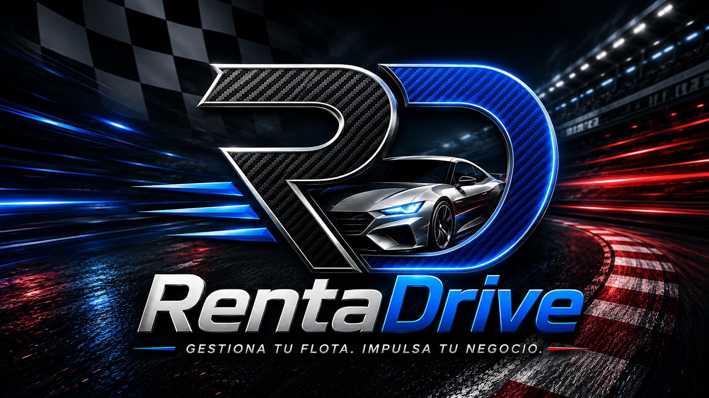

<p align="center">
  
</p>

<p align="center">
  
</p>

<p align="center">

  
  
  
  
</p>

<p align="center">
  
  
  
  
</p>

**RentaDrive** es una plataforma web profesional para la gestión integral de empresas de alquiler de vehículos. Centraliza clientes, flota, reservas, alquileres, contratos, inspecciones, mantenimiento, facturación, pagos, reportes, usuarios, configuración y auditoría dentro de un flujo operativo completo.

El proyecto nació como trabajo final de la asignatura **Análisis y Diseño de Sistemas (SOF-007)** del Instituto Tecnológico de Las Américas (ITLA) y fue modernizado en 2026 como una aplicación funcional con Laravel, Microsoft SQL Server y una arquitectura monolítica modular.

## ✅ Estado actual

La versión **1.0.0** está finalizada y lista para uso académico, portafolio profesional y evolución comercial.

- 🧪 35 pruebas automatizadas aprobadas.
- 🎯 103 assertions.
- 🎨 Laravel Pint validado.
- ⚡ Build de Vite aprobado.
- 🗄️ SQL Server como motor principal y SQLite en memoria para testing.
- 📊 Dashboard con métricas, gráficos y calendario.
- 📱 Aplicación instalable como PWA.
- 📄 Facturas, contratos y reportes operativos en PDF.
- 📤 Reportes exportables en CSV.
- ♿ Primera fase de accesibilidad basada en NORTIC B2:2017 y WCAG 2.0.

# 🧩 Funcionalidades

## 🚗 Operaciones

- 👤 Gestión de clientes, documentos, contacto y licencias.
- 🪪 Validación local de cédulas dominicanas por dígito verificador.
- 🔢 Validación de longitud para cédula, RNC y pasaporte.
- 🚘 Gestión de marcas, modelos, categorías, tarifas, depósitos y vehículos.
- 🚦 Estados de flota: disponible, reservado, alquilado, mantenimiento e inactivo.
- 🛠️ Historial y programación de mantenimientos.
- 📅 Reservas con validación de disponibilidad y solapamiento.
- 🔄 Conversión de reservas en alquileres.
- 🔑 Apertura y cierre de alquileres.
- ⛽ Gestión de kilometraje, combustible, depósitos, cargos y fechas.
- 📸 Inspecciones de entrega y devolución.

## 💰 Finanzas

- 🧾 Facturación automática.
- 🇩🇴 ITBIS fijo del 18 % protegido desde backend.
- 💳 Pagos parciales y totales.
- ↩️ Anulación de pagos y recálculo del balance.
- 📄 Facturas, contratos y reportes en PDF.
- 📊 Reportes operativos en PDF y CSV.

## 📊 Experiencia de usuario

- 📈 Indicadores operativos en tiempo real.
- 💹 Gráfico de ingresos.
- 🚙 Distribución del estado de la flota.
- 🗓️ Calendario de reservas.
- 🔔 Notificaciones tipo toast.
- 🌗 Modo claro y oscuro.
- 📱 Diseño responsive.
- 🎯 Navegación con Font Awesome.
- 🚫 Páginas personalizadas 404 y 500.

## 🔐 Administración y seguridad

- 👥 Gestión de usuarios activos e inactivos.
- 🛡️ Roles y permisos por módulo.
- 🚧 Policies y middleware de autorización.
- 🧿 Protección CSRF.
- ✅ Validaciones mediante Form Requests.
- 🧾 Auditoría automática.
- 🗑️ Eliminación segura de cuentas.

# ♿ Accesibilidad

RentaDrive incorpora una primera fase transversal de accesibilidad inspirada en la **NORTIC B2:2017** y las **WCAG 2.0**, con objetivo técnico de aproximación al nivel **AA**.

## Funcionalidades accesibles implementadas

- ⌨️ Navegación mediante teclado.
- 🔗 Enlaces para saltar al contenido principal y a la navegación.
- 🎯 Indicadores de foco visibles.
- 🧭 Regiones semánticas mediante `header`, `aside`, `main` y `footer`.
- 🏷️ Nombres accesibles y atributos ARIA en controles interactivos.
- 🚨 Mensajes de error con `role="alert"` y notificaciones `aria-live`.
- 🔠 Ajuste persistente del tamaño del texto a 100 %, 125 %, 150 % y 200 %.
- ◐ Modo de alto contraste.
- 🧘 Reducción de movimiento.
- ⚙️ Respeto de la preferencia del sistema `prefers-reduced-motion`.
- ⎋ Cierre de menús desplegables mediante la tecla `Escape`.
- 💾 Persistencia local de preferencias de accesibilidad.
- 🖼️ Textos alternativos para imágenes informativas e imágenes decorativas ignoradas por tecnologías asistivas.

La implementación responde a criterios como contenido no textual, contraste mínimo, cambio de tamaño del texto, teclado, ausencia de trampas de foco, evitar bloques repetidos, orden de foco, encabezados y etiquetas, foco visible, identificación de errores y nombre, función y valor de los componentes.

> **Importante:** el proyecto todavía no declara una certificación formal NORTIC B2. La conformidad completa requiere auditoría por módulo, validación de todos los procesos, pruebas con lectores de pantalla y evaluación mediante herramientas automáticas.

Documentación técnica detallada:

```text
docs/accessibility.md
```

Validaciones manuales recomendadas:

- Navegar usando únicamente `Tab`, `Shift + Tab`, `Enter`, `Space` y `Escape`.
- Probar el escalado de texto hasta 200 % sin pérdida de contenido o funcionalidad.
- Verificar los modos claro, oscuro y alto contraste.
- Probar la reducción de movimiento.
- Revisar login, dashboard, formularios, tablas y menús con NVDA.
- Ejecutar Lighthouse Accessibility y axe DevTools.

# 🧰 Stack tecnológico

## ⚙️ Backend

<p>
  
  
  
</p>

- 🐘 **PHP 8.4.1 o superior**.
- 🔺 **Laravel 13.8**.
- 📦 **Composer** para gestión de dependencias.
- 🗃️ **Eloquent ORM** para persistencia y relaciones.
- 🧱 Migraciones, seeders, factories y servicios de dominio.
- 🧩 Arquitectura monolítica modular.

## 🎨 Frontend

<p>
  
  
  
  
  
  
</p>

- 🧩 **Blade** y HTML5.
- 🎨 **Tailwind CSS 3.4**.
- 🏔️ **Alpine.js 3.15**.
- 🟨 **JavaScript ES Modules**.
- 📊 **Chart.js 4.5**.
- 🎯 **Font Awesome 6.7**.
- ⚡ **Vite 8**.

## 🗄️ Base de datos

<p>
  
  
</p>

- 🪟 **Microsoft SQL Server 2017 o superior**.
- 🔌 **ODBC Driver 17 o 18**.
- 🧩 Extensiones PHP `sqlsrv` y `pdo_sqlsrv`.
- 🧪 **SQLite en memoria** para pruebas automatizadas.

## ♿ Accesibilidad

<p>
  
  
  
</p>

- ⌨️ Navegación completa mediante teclado.
- 🎯 Foco visible y orden lógico de navegación.
- 🔎 Escalado de texto hasta 200 %.
- ◐ Alto contraste y reducción de movimiento.
- 🧭 Landmarks semánticos, ARIA y enlaces de salto.
- 🔈 Mensajes accesibles para lectores de pantalla.

## 🧪 Calidad, build y CI

<p>
  
  
  
  
</p>

- 🧪 **PHPUnit 12.5**.
- 🎨 **Laravel Pint 1.27**.
- 🎭 **Mockery**.
- 🧬 **Faker**.
- 🤖 **GitHub Actions** para integración continua.
- 🟢 **Node.js 22+** y npm 10+.

# 📥 Instalación

## 1. Clonar el repositorio

```bash
git clone https://github.com/Jairo0811/RentaDrive.git
cd RentaDrive
```

## 2. Instalar dependencias

```bash
composer install
npm install
```

## 3. Crear el archivo de entorno

```powershell
Copy-Item .env.example .env
```

## 4. Generar la clave

```bash
php artisan key:generate
```

## 5. Configurar SQL Server

```dotenv
DB_CONNECTION=sqlsrv
DB_HOST=127.0.0.1
DB_PORT=1433
DB_DATABASE=RentaDriveDb
DB_USERNAME=rentadrive_app
DB_PASSWORD=RentaDrive_Local_2026!
DB_ENCRYPT=no
DB_TRUST_SERVER_CERTIFICATE=true
```

## 6. Configurar credenciales iniciales

```dotenv
RENTADRIVE_ADMIN_EMAIL=admin@rentadrive.com.do
RENTADRIVE_ADMIN_PASSWORD=RentaDrive123..
```

> Cambia estas credenciales antes de publicar la aplicación.

## 7. Crear tablas y datos iniciales

```bash
php artisan optimize:clear
php artisan migrate:fresh --seed
php artisan storage:link
```

## 8. Compilar y validar

```bash
vendor/bin/pint --test
php artisan test
npm run build
```

## 9. Iniciar la aplicación

Para uso exclusivo en la PC:

```bash
php artisan serve
```

Abrir:

```text
http://127.0.0.1:8000
```

### 📱 Probar RentaDrive desde un móvil en la misma red

Para levantar Laravel y Vite preparados para acceso LAN:

```bash
composer dev:lan
```

Luego obtén la IPv4 de la PC con `ipconfig` y abre desde el móvil:

```text
http://<IP-DE-LA-PC>:8000
```

Ejemplo:

```text
http://192.168.1.50:8000
```

La PC y el móvil deben estar conectados a la misma red. Si Windows solicita permiso de firewall para PHP o Node.js, permite únicamente redes privadas.

# 🔑 Credenciales locales

```text
Correo: admin@rentadrive.com.do
Contraseña: RentaDrive123..
```

# 🎓 Ficha académica

| Campo | Información |
|---|---|
| 🏫 Institución | Instituto Tecnológico de Las Américas (ITLA) |
| 🎓 Carrera | Tecnólogo en Desarrollo de Software |
| 📘 Asignatura | Análisis y Diseño de Sistemas (SOF-007) |
| 👨‍🏫 Profesor | Huascar Frias Vilorio |
| 📅 Período académico | 2017-C1 |
| 👨‍💻 Estudiante | Francis Jairo Matías Rosario |
| 🪪 Matrícula | 2015-2984 |
| 🚘 Proyecto | RentaDrive |
| 🛠️ Modernización | 2026 |

# 👨‍💻 Autor

**Francis Jairo Matías Rosario**  
Matrícula: **2015-2984**  
GitHub: [@Jairo0811](https://github.com/Jairo0811)

# 🗺️ Evolución futura

- Completar auditoría de accesibilidad por módulo y proceso.
- Incorporar pruebas automatizadas de accesibilidad al flujo CI.
- Multiempresa y multisucursal.
- Firma digital de contratos.
- Integración con correo y WhatsApp.
- API REST con OpenAPI/Swagger.
- Integración oficial con servicios de identidad, cuando exista acceso autorizado.

# 📄 Licencia

Este proyecto se distribuye bajo la licencia **MIT**.