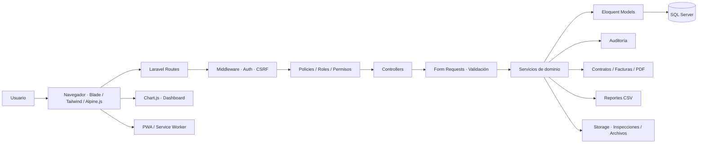
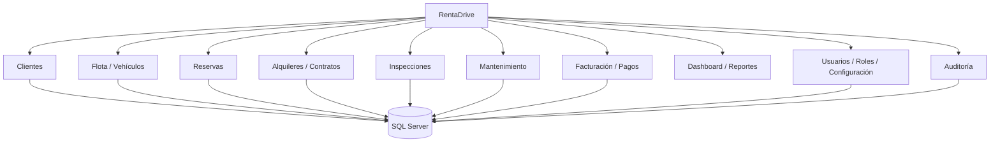
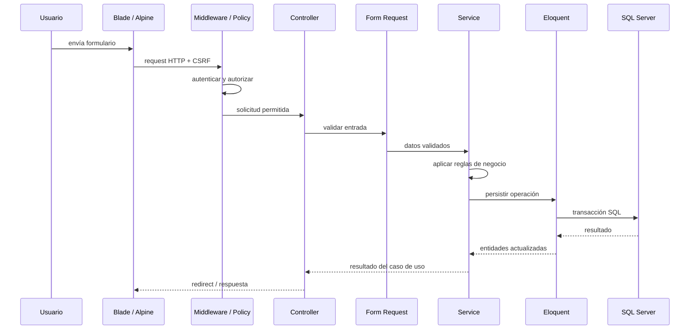
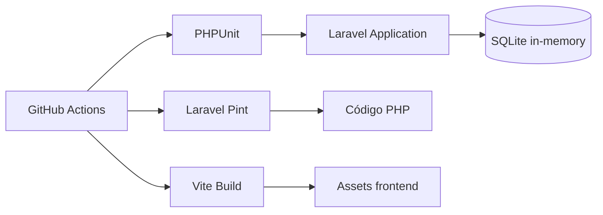

# Arquitectura de RentaDrive

RentaDrive está implementado como un **monolito modular Laravel**. La aplicación mantiene un único despliegue y una única base transaccional, pero separa autenticación, operaciones de renta, flota, clientes, finanzas, reportes y administración mediante responsabilidades de framework y servicios de dominio.

## Vista general

El navegador nunca accede directamente a Eloquent ni a SQL Server. Autenticación, permisos, validaciones y reglas de negocio se resuelven en backend antes de persistir cualquier cambio.

## Módulos funcionales

## Flujo de una operación

## Persistencia

- **SQL Server** es el motor principal de desarrollo y operación.
- **Eloquent ORM** encapsula relaciones y persistencia.
- Migraciones y seeders versionan el esquema y los datos iniciales.
- Las reglas sensibles, como disponibilidad, estados de alquiler, ITBIS y balances, permanecen en backend.

## Pruebas

SQLite en memoria se utiliza para pruebas automatizadas rápidas; SQL Server continúa siendo la referencia de producción/desarrollo para la persistencia principal.

## Decisiones arquitectónicas

- Monolito modular antes que microservicios: los módulos comparten transacciones y ciclo de despliegue.
- Controllers delgados; la lógica reutilizable y reglas complejas deben vivir en servicios o modelos apropiados.
- Form Requests centralizan validación de entrada.
- Policies y middleware centralizan autorización.
- Blade/Alpine se mantienen como capa de presentación; no contienen reglas financieras autoritativas.
- Integraciones de documentos, reportes y almacenamiento permanecen separadas de la lógica principal.
