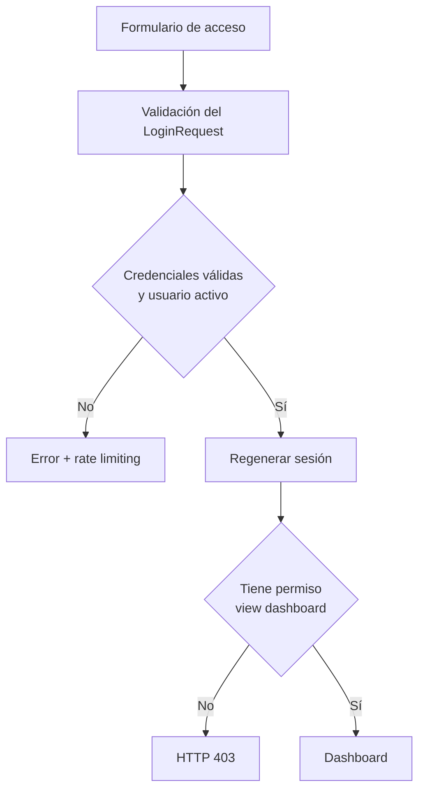

# Fase 1 — Fundación técnica

## Objetivo

Establecer una base Laravel instalable, segura y extensible antes de implementar la lógica de alquiler de vehículos.

## Decisiones

| Decisión | Motivo |
|---|---|
| Laravel 13.8 y PHP 8.3+ | Versiones estables y compatibles con las dependencias seleccionadas |
| Monolito modular | Reduce complejidad operativa sin mezclar responsabilidades |
| Blade + Tailwind + Alpine.js | Interfaz server-rendered coherente con el alcance inicial |
| Spatie Laravel Permission | Roles y permisos mantenibles, compatibles con Policies y Gates |
| Registro público deshabilitado | El sistema es administrativo; las cuentas deben ser controladas |
| Seeder de administrador solo local/testing | Evita credenciales conocidas en producción |
| SQL Server para la aplicación y SQLite en memoria para pruebas locales | Alinea la persistencia con el ecosistema Microsoft y conserva una suite local rápida |
| SQL Server 2022 en integración continua | Verifica migraciones y pruebas contra el motor real del proyecto |
| Módulos futuros visibles como deshabilitados | Comunica la hoja de ruta sin simular funciones inexistentes |

## Árbol inicial

```text
app/
├── Domain/
│   └── Security/
│       ├── Enums/
│       │   ├── PermissionName.php
│       │   └── RoleName.php
├── Http/
│   ├── Controllers/
│   │   ├── Auth/
│   │   ├── DashboardController.php
│   │   └── ProfileController.php
│   └── Requests/
├── Models/
│   └── User.php
└── Policies/
    └── UserPolicy.php
```

Los dominios `Customers`, `Fleet`, `Reservations`, `Rentals`, `Inspections`, `Billing` y `Reports` se crearán cuando empiece su fase. No se agregan carpetas vacías ni abstracciones sin uso.

## Flujo de acceso



## Matriz de entrega

| Elemento | Estado | Evidencia |
|---|---|---|
| Proyecto Laravel | Completado | `composer.json`, `artisan`, estructura base |
| Configuración SQL Server | Completado | `.env.example`, `config/database.php` |
| Breeze Blade | Completado | controladores, requests, vistas y rutas de autenticación |
| Roles y permisos | Completado | enums, migración y seeders |
| Policies y middleware | Completado | `UserPolicy`, aliases y rutas protegidas |
| Layout responsive | Completado | sidebar, topbar y navegación móvil |
| Modo oscuro | Completado | preferencia persistente en `localStorage` |
| Usuario administrador | Completado | `AdminUserSeeder`, limitado a local/testing |
| Pruebas | Implementadas | autenticación, usuario inactivo, registro cerrado y autorización |
| Ejecución de PHPUnit | Pendiente del entorno | requiere PHP y Composer instalados |

## Criterios de aceptación

- `composer install` resuelve dependencias compatibles con Laravel 13.
- La CI crea `RentaDriveTest` en SQL Server 2022 y ejecuta la suite completa.
- `php artisan migrate --seed` crea tablas, permisos, roles y el administrador local.
- Un visitante es redirigido al login.
- Un usuario inactivo no inicia sesión.
- Un usuario sin `view dashboard` recibe HTTP 403.
- Los cuatro roles configurados pueden abrir el dashboard.
- Solo un administrador puede eliminar otro usuario mediante la Policy.
- El registro público responde HTTP 404.
- `npm run build` genera los assets sin errores.
- La preferencia de modo oscuro persiste al recargar.
- El layout funciona en móvil y escritorio.

## Fuera de alcance

Catálogos, vehículos, clientes, reservas, alquileres, inspecciones, devoluciones, facturas, pagos, reportes y auditoría pertenecen a las fases siguientes.
