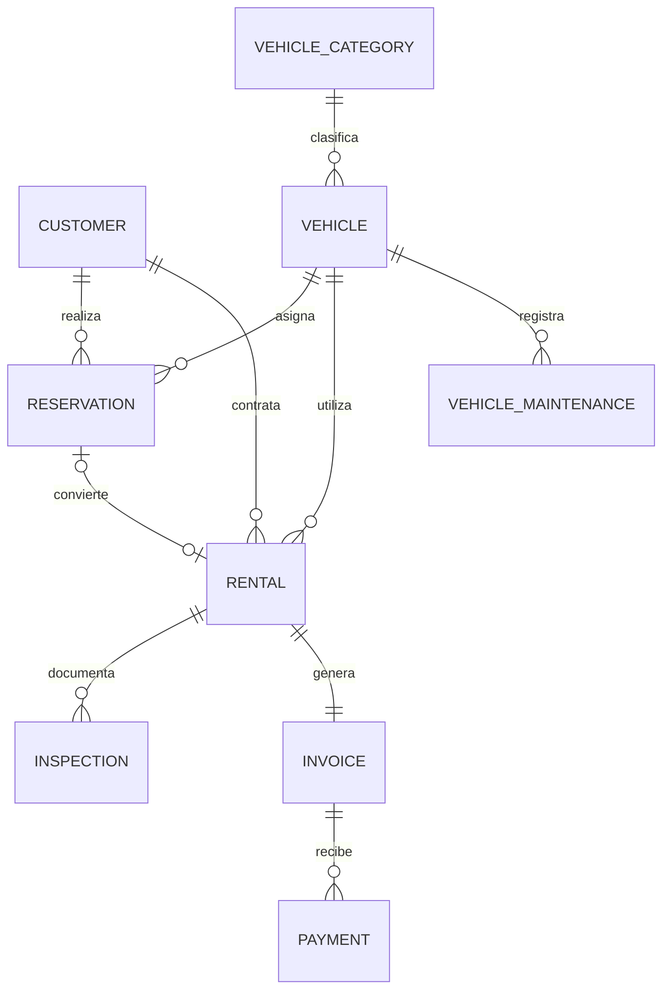

# RentaDrive 1.0 — Alcance y cierre

## Objetivo

Completar el recorrido principal de una empresa de alquiler de vehículos sobre la fundación Laravel + SQL Server de la fase 1, manteniendo permisos, trazabilidad y una interfaz coherente con la identidad RentaDrive.

## Matriz de fases

| Fase | Alcance | Estado | Criterio de terminado |
|---|---|---|---|
| 1 | Fundación técnica | Completada | Autenticación, roles, permisos, modo oscuro, CI y SQL Server |
| 2 | Catálogos y flota | Completada | Marcas, modelos, categorías, tarifas, vehículos y estados |
| 3 | Clientes | Completada | Expediente, documentos, licencia, contacto e historial |
| 4 | Reservas | Completada | Agenda, tarifa estimada, vehículo opcional y detección de solapamiento |
| 5 | Alquileres y contratos | Completada | Apertura, cálculo, contrato, estado de unidad y conversión desde reserva |
| 6 | Inspecciones y devoluciones | Completada | Inspección de entrega/retorno, fotos, cierre, kilometraje y combustible |
| 7 | Facturación y pagos | Completada | Factura automática, PDF, pagos parciales, balance y anulación |
| 8 | Dashboard y reportes | Completada | Indicadores reales, próximos eventos, reportes y exportación CSV |
| 9 | Administración y auditoría | Completada | Usuarios, configuración, roles, trazabilidad y protección de secretos |
| 10 | QA y documentación | Implementada | Pruebas críticas, compilación Vite, README y guía de actualización |

## Modelo funcional



## Reglas de negocio

1. Solo clientes activos pueden seleccionarse en nuevas operaciones.
2. Un vehículo en mantenimiento o inactivo no puede reservarse ni alquilarse.
3. Dos reservas confirmadas o pendientes no pueden solaparse sobre el mismo vehículo.
4. Un alquiler abierto bloquea el vehículo durante su período.
5. Abrir un alquiler cambia la unidad a `rented` y genera su factura.
6. Convertir una reserva cambia su estado a `converted`.
7. El cierre recalcula días, cargos, impuesto, factura, kilometraje y estado de la unidad.
8. Un pago no puede exceder el balance de la factura.
9. Anular un pago recalcula automáticamente el total pagado y el estado de la factura.
10. Clientes y vehículos con operaciones se inactivan o suspenden; no se eliminan.
11. Creaciones, cambios y eliminaciones de datos operativos quedan auditados.
12. Contraseñas y tokens nunca se almacenan en el registro de auditoría.

## Tablas agregadas

- `customers`
- `vehicle_brands`
- `vehicle_categories`
- `vehicle_models`
- `vehicles`
- `vehicle_maintenances`
- `reservations`
- `rentals`
- `inspections`
- `invoices`
- `payments`
- `settings`
- `audit_logs`

## Decisiones técnicas

- Monolito modular para conservar una instalación simple.
- Servicios de dominio para referencias, disponibilidad y flujo de alquiler.
- Transacciones en apertura/cierre de alquiler y pagos.
- Índices únicos filtrados en SQL Server para columnas opcionales.
- Auditoría mediante un concern reutilizable en modelos operativos.
- PDF generado en servidor y contrato HTML imprimible.
- CSV transmitido sin cargar todo el archivo en memoria.
- Fotografías almacenadas en el disco público de Laravel.

## Validación

Antes de publicar:

```bash
php artisan optimize:clear
php artisan migrate
php artisan db:seed
php artisan storage:link
php artisan test
./vendor/bin/pint --test
npm run build
```

## Evolución posterior

La versión 1.0 queda cerrada sin depender de estas ideas:

- múltiples sucursales y multiempresa;
- pagos en línea;
- firma digital biométrica;
- API móvil;
- notificaciones por WhatsApp o correo;
- geolocalización;
- contabilidad e integración fiscal;
- reservas públicas para clientes.

Estas funciones pueden desarrollarse como versión 2.0 sin modificar el recorrido central.
